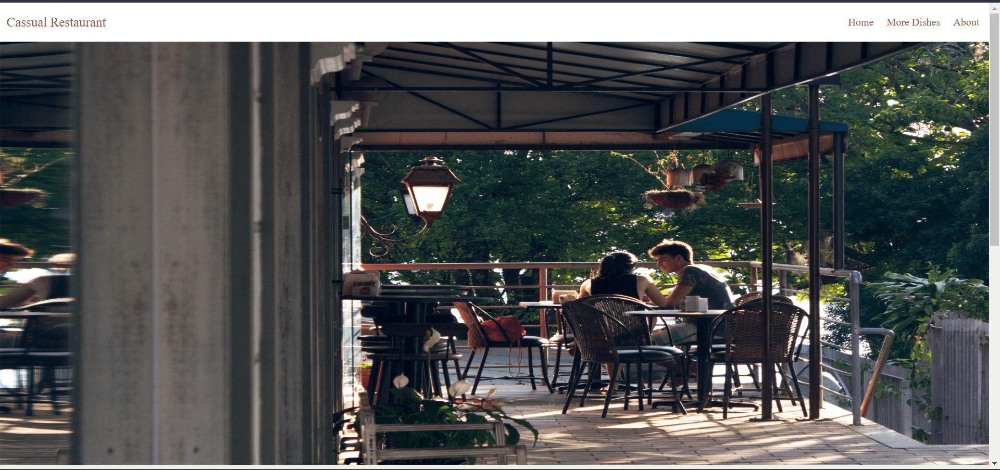

# Restaurant-Page-js
> This project is a javascript webpack and es6 functionalities. with different types of module pages.

## Home Page

## Built With 
HTML   CSS   JavaScript

## Live Demo

[Live Demo link](https://yinktech.github.io/Restaurant-Page-js/)

## Authors

👤 **Author 1**

- GitHub: [@YinkTech](https://github.com/yinktech)
- Twitter: [@YinkTech](https://twitter.com/yinktech)
- LinkedIn: [Ayeni Olayinka](https://www.linkedin.com/in/yinktech/)

## 🤝 Contributing
Contributions, issues, and feature requests are welcome!

Feel free to check the [issues page](https://github.com/YinkTech/Restaurant-Page-js/issues).

## Show your support

Give a ⭐️ if you like this project!

